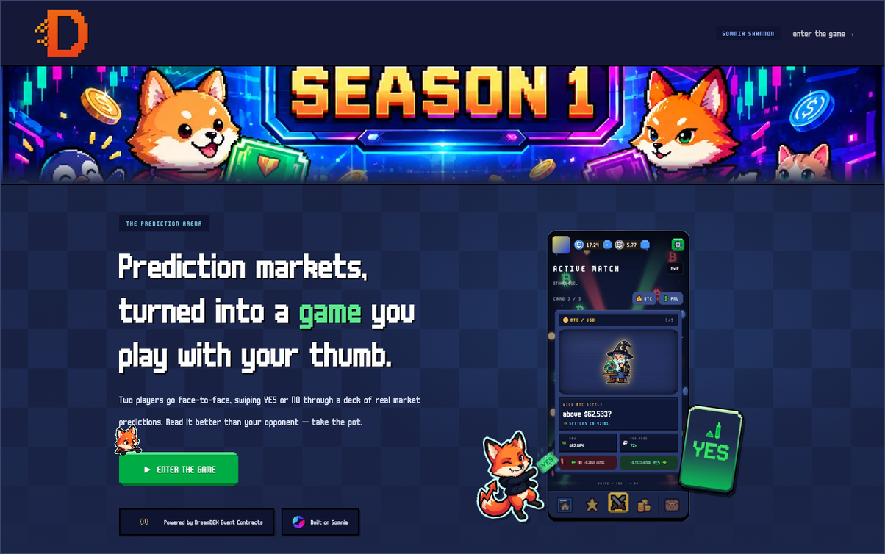
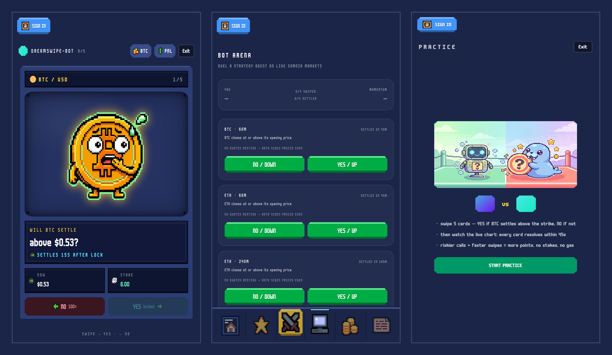
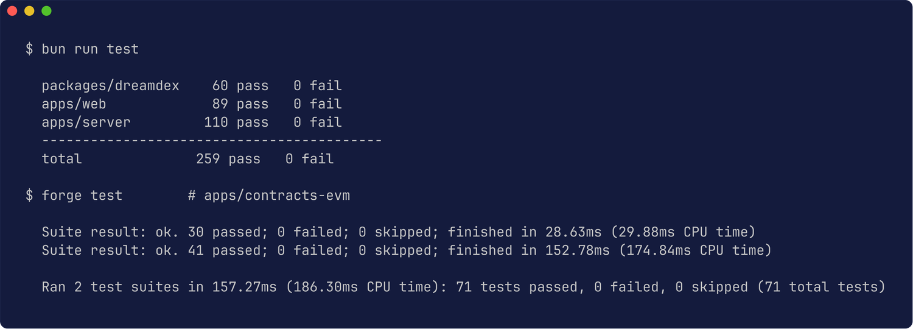
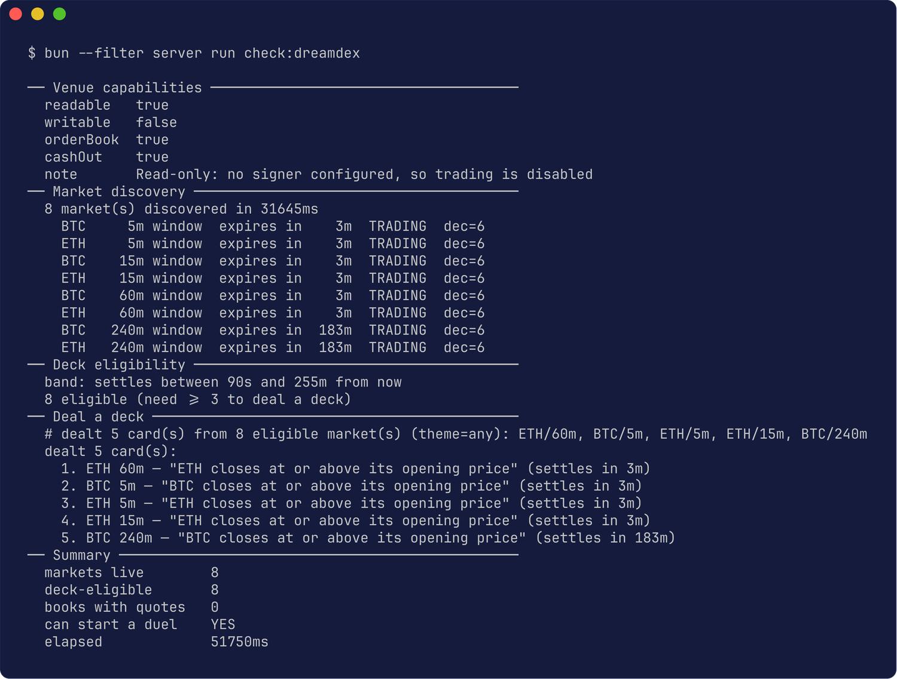

<div align="center">


**Two players. One deck. Swipe YES/NO through live binary prediction markets —
on-chain escrow pays whoever read the market better.**

[](https://dreamswipe.vercel.app)
[](https://shannon-explorer.somnia.network)
[](#verified-not-asserted)
[](#license)

[**▶ Play the demo**](https://dreamswipe.vercel.app) ·
[API health](https://dreamswipe-server.onrender.com/health) ·
[Duel contract](https://shannon-explorer.somnia.network/address/0x6b554BaFC2031b72AeB100cDAd111c2f70f2cC5c) ·
[Architecture](#architecture)

</div>

> [!NOTE]
> The API runs on Render's free tier and sleeps when idle. The first request
> after a nap takes ~30s to wake — if the lobby looks empty, give it a moment
> and reload. **Practice and Bot Arena need no wallet.**

---

## The pitch

Prediction markets are powerful but look like a Bloomberg terminal. Swipe-betting
apps proved retail loves feel-based prediction UX — but they're shallow,
custodial, and have **no real opponent**.

DreamSwipe is both. Two players swipe through the same deck of live DreamDEX
event contracts. Scoring is the actual economics — `netResult = realizedValue −
entryCost` — so the winner is whoever genuinely read the market better, not
whoever tapped faster.

<div align="center">

</div>

---

## The game

<div align="center">

<sub><b>Left:</b> the swipe deck — one binary market per card, YES/UP or NO/DOWN, with a live strike and spot.
<b>Centre:</b> Bot Arena, dealing real BTC/ETH windows discovered on chain.
<b>Right:</b> the Practice intro. All three screens above are signed out — no wallet needed.</sub>
</div>

| Mode | Stake | Wallet | Chain |
| --- | --- | --- | --- |
| **Practice** | — | not needed | fully simulated |
| **Bot Arena** | — | not needed | live market data, 4 strategy agents |
| **Free PvP** | 0 | yes | same engine, money flow gated off |
| **Staked PvP** | tUSDC | yes | escrowed, winner takes the pot |

Free and Staked share **one** code path. The tier gates only whether collateral
moves, and a Free duel carrying a stake reverts on chain.

---

## Deployed on Somnia Shannon

Every address below is live. `eth_getCode` returns real bytecode for all three,
and `decimals()` on the collateral token returns `6` — read from the token, not
assumed.

| | |
| --- | --- |
| **Chain** | Somnia Shannon testnet · `50312` (`0xc488`) |
| **RPC** | `https://dream-rpc.somnia.network` |
| **DreamSwipeDuel** | [`0x6b554BaFC2031b72AeB100cDAd111c2f70f2cC5c`](https://shannon-explorer.somnia.network/address/0x6b554BaFC2031b72AeB100cDAd111c2f70f2cC5c) |
| ↳ deploy tx | [`0xd35fee41…09b7809b`](https://shannon-explorer.somnia.network/tx/0xd35fee418d1a12ca93c4e55136a9aaa9613264a8e1425cc6a57cb49809b7809b) · block `483885846` · **38,853,709 gas** |
| **SeasonPrizePool** | [`0xB380814066dcb5d0b4d4968742bFdC005D1FB4a7`](https://shannon-explorer.somnia.network/address/0xB380814066dcb5d0b4d4968742bFdC005D1FB4a7) |
| ↳ deploy tx | [`0xd0b86f9d…575c140f`](https://shannon-explorer.somnia.network/tx/0xd0b86f9de4558a10121941013158114d0687517598db9617082563b9575c140f) · block `483959460` · **15,573,469 gas** |
| **Collateral** | [tUSDC `0x70a86D88…1BB25d8E`](https://shannon-explorer.somnia.network/address/0x70a86D8842FB63C4Ad2b7cdddF530eBf1BB25d8E) — **6 decimals**, permissionless `faucet(uint256)` |
| **Gas token** | STT — players sign swipes, a relayer pays |
| **Venue** | DreamDEX Event Contracts (binary Up/Down markets) |

Full record, including gas findings:
[`deployments/somnia-testnet.json`](deployments/somnia-testnet.json)

---

## Verified, not asserted

Every number here came from a command that was actually run.

### The test suite



### The live venue

This scans `MarketCreated` logs straight off chain — no indexer, no API key,
no wallet. Run it yourself with `bun --filter server run check:dreamdex`:



Eight live windows discovered by log scan, a real five-card deck dealt from
them, and `can start a duel: YES`. The full run also prints each order book —
they are genuinely empty on testnet, and the tool reports
`no quotes resting` rather than inventing a mid price.

### The full duel lifecycle, on chain

Executed against the deployed contract with real transactions
(`bun --filter server run e2e:somnia`):

```
createDuel → joinDuel (2nd wallet) → revealDeck
           → 2× relayed swipe → settleCard ×3 → finalize
```

Read back from chain: `status Complete · 3/3 settled · p0 +600000 · p1 −400000`.
Those numbers are the economics exactly — backing UP at 0.40 and winning
redeems 1.00 (+0.60); the loser forfeits their 0.40 premium.

**Neither player sent a transaction.** Both signed EIP-712 messages and the
relayer submitted them. No wallet popup mid-duel, no gas from the player.

Staked duels are verified with real collateral (`e2e:staked`): 5 tUSDC escrowed
per side, 10 held, the winner paid the whole pot, and escrow back to exactly 0
with nothing stranded. Seasons the same way (`e2e:season`): create → fund →
allocate → finalize → claim, with the claim sent **by the winner**, `claimable`
correctly 0 before finalization, and a second claim rejected with
`AlreadyClaimed`.

---

## Architecture

```
apps/web            React 19 · Vite · Tailwind v4 · wagmi + viem
apps/server         Bun · WS relay · matchmaking · relayer · keeper · MMR
apps/contracts-evm  Solidity 0.8.24 (Foundry) · DreamSwipeDuel · SeasonPrizePool
packages/dreamdex   venue boundary: types, CLOB math, Bot Arena agents
packages/ui         shared shadcn components
```

**There is no Sui left.** Zero `@mysten` imports and zero `@mysten`
dependencies: the Move package, DeepBook adapter, Pyth oracle stream, zkLogin
auth and sponsored-gas service are all gone, replaced by the EVM equivalents
above. What was reused versus rewritten is recorded in
[`docs/MIGRATION_AUDIT.md`](docs/MIGRATION_AUDIT.md).

One rule holds the design together: **nothing outside `packages/dreamdex` may
import the venue SDK.** This repo already lost ~12 days of playability when a
previous venue was torn down, so "what are the cards" is swappable without
touching "run a duel".

### Honesty is enforced in the types

`specs/06_FRONTEND.md` says *"No fake live values"*, and that is a type
signature here, not a convention:

- anything not derivable returns **`null`, never `0`** — a zero spread and an
  unknown spread must never look alike
- `insufficientLiquidity` carries a **partial** fillable size, so the UI shows
  what the book can really fill
- no tx hash, order id, fill or price is ever synthesized; the adapter throws
  `VenueUnavailableError` instead
- `getFills` **throws rather than returning `[]`**, because an empty array is
  indistinguishable from "not implemented"

### Swipes are signatures, not transactions

The player signs an EIP-712 message binding
`(duelId, cardIdx, direction, nonce, deadline)`. The relayer submits it and pays
the gas. It can neither forge nor replay a swipe, and it cannot touch escrow.

`premium` and `filled` are derived **server-side from the live venue**, never
taken from the request body — a client-supplied premium would let a player
understate their entry cost and inflate their own PnL.

### Bot Arena fairness is structural

Bots see exactly what a human sees, and that is enforced by the type rather
than by policy: `PredictionContext` has no `winner`, `settlementPrice` or
`resolved` field, so an agent **cannot** see an outcome even in principle. A
test pins the exact key set, so adding one later trips a tripwire.

Difficulty raises the signal threshold a bot needs before acting — it never
changes what the bot can see.

### Seasons

Prizes are **escrowed**, not promised. Allocations freeze at finalization, so an
operator cannot rewrite who gets what after seeing the leaderboard; each winner
claims once; and the surplus sweep is bounded by `funded - allocated`, so an
unclaimed prize can never be swept out from under a late claimer.

---

## Quick start

```bash
bun install
cp .env.example .env        # add a funded Shannon key for writes
bun dev                     # web :5173 + server :3001
```

**tUSDC has a permissionless on-chain faucet** — call `faucet(uint256)` on the
token; no external step is needed for collateral. STT for gas comes from the
SomniaHacks group: <https://t.me/+XHq0F0JXMyhmMzM0>

```bash
bun typecheck   # 4 packages
bun run test    # 264 tests
bun build

bun --filter server run check:dreamdex   # live venue probe, no key needed

cd apps/contracts-evm && forge test      # 71 tests, incl. 2 fuzzed invariants
```

> [!TIP]
> `forge` on some machines is shadowed by an unrelated CLI of the same name.
> If `forge test` behaves oddly, use `~/.config/.foundry/bin/forge`.

---

## Two traps worth knowing

Both cost real debugging time and are documented in
[`docs/DREAMDEX_INTEGRATION.md`](docs/DREAMDEX_INTEGRATION.md).

**Somnia deploy gas.** Foundry estimated 3,394,836 gas; the deploy actually
needed **38,853,709** — 11×. Worse, an under-limit deploy mines with
`status: 0` and burns the entire limit while `eth_call` simulation still
succeeds, so simulation cannot catch it. Three deploys failed that way before
60M worked. The estimate is unreliable in *both* directions: the tUSDC faucet
call was estimated at 1,379,707 gas, actually used 253,138 — and a 500,000
limit still mined `status: 0` and burned the lot.

**The spec pack's DreamDEX constants were wrong in three ways** — package name,
collateral token, and decimals. Building on them unchecked would have mispriced
every order by 10¹² on mainnet with nothing reverting to warn you. Corrections
are recorded in [`docs/MIGRATION_AUDIT.md`](docs/MIGRATION_AUDIT.md) §2.2.

This is not a hypothetical. A stale 9-decimal formatter survived the migration
into the UI and rendered every practice strike as `$0` — the value was correct
on the wire and 1000× too small on screen, with nothing to revert. Fixed in
`c683146`, now pinned by tests.

---

## Docs

| | |
| --- | --- |
| [`MIGRATION_AUDIT.md`](docs/MIGRATION_AUDIT.md) | what was reused, replaced, and verified |
| [`DREAMDEX_INTEGRATION.md`](docs/DREAMDEX_INTEGRATION.md) | venue facts, traps, and a real bug the health check caught |
| [`DEPLOYMENT.md`](docs/DEPLOYMENT.md) | deploying the web app, server, and contracts |
| [`deployments/somnia-testnet.json`](deployments/somnia-testnet.json) | addresses, tx hashes, gas findings |

---

## License

Apache-2.0
